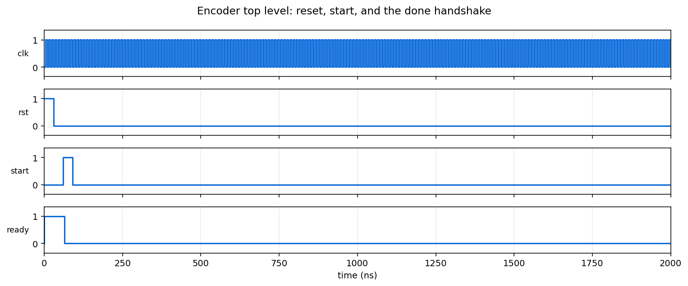

# Encoder Pipeline

A five-stage permutation encoder in Verilog. Each stage is a separate
controller and datapath pair, and stages hand results to each other through
files, so any one of them can be simulated and inspected on its own.



## Requirements

[Icarus Verilog](https://steveicarus.github.io/iverilog/) and `make`. The design
was originally developed against ModelSim; nothing here depends on it.

## Simulating

```bash
make sim
```

Runs the whole pipeline over `trunk/sim/file/input_0.txt`, which holds 64 words
of 25 bits. Every stage writes the input for the next, so a completed run leaves
the full chain of intermediates behind.

## The pipeline

```
input_0.txt
   └── colParity    ──► colPInput.txt
         └── rotate       ──► rotateInput.txt
               └── permute      ──► permuteInput.txt
                     └── addRc        ──► addRcInput.txt
                           └── revaluate  ──► revaluateInput.txt
```

A completed run, first word of each file:

| stage | first word |
| --- | --- |
| input | `0000110100111011101110101` |
| colParity | `1100111101010001011110010` |
| rotate | `0100100011010001101011010` |
| permute | `0110111010110000100001111` |
| addRc | `1100111101011001011110010` |
| revaluate | `1110111001010010011110000` |

Every stage produces a distinct result, which is the check that the chain is
actually running rather than passing data through untouched.

## Structure

Each stage follows the same shape, which makes the design readable once and
reusable five times:

| file | role |
| --- | --- |
| `<stage>.v` | Ties the parts together and exposes the stage's interface |
| `<stage>_controller.v` | The state machine sequencing the stage |
| `<stage>_datapath.v` | Registers, counters and the arithmetic |
| `<stage>_file_reader.v` | Streams the previous stage's output in |
| `<stage>_file_writer.v` | Streams this stage's result out |

Splitting control from data means a stage can be retimed or widened without
touching its sequencing, and the file boundary between stages means each can be
brought up and debugged in isolation before the whole chain is closed.

## Project structure

```
trunk/src/hdl/
    top_level.v              drives the five stages in order
    top_level_controller.v   the outer state machine
    top_level_dp.v           the outer datapath
    colParity/               stage 1
    rotate/                  stage 2
    permute/                 stage 3
    addRc/                   stage 4
    revaluate/               stage 5
    counter64.v, counter25.v, register25b.v   shared building blocks
trunk/sim/
    tb/TB.v                  drives reset, start and waits for done
    file/input_0.txt         the input vectors
docs/waveform.png            the figure above
Makefile                     sim and clean
```
